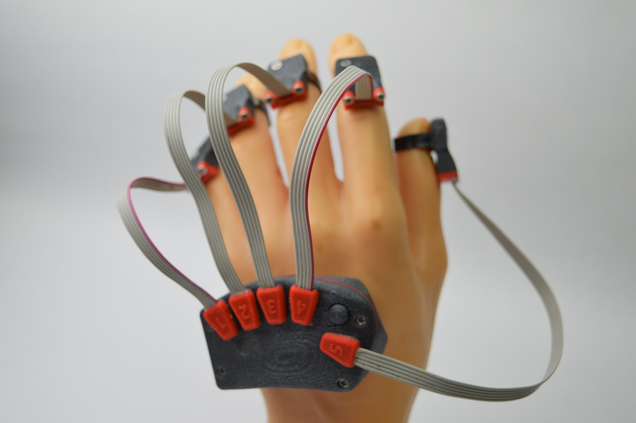
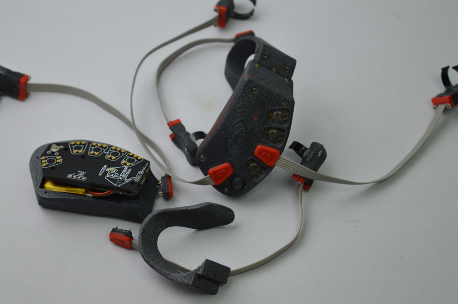
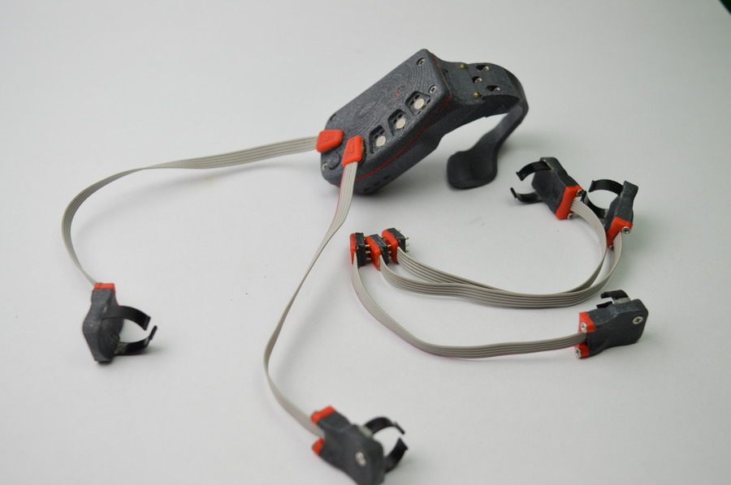
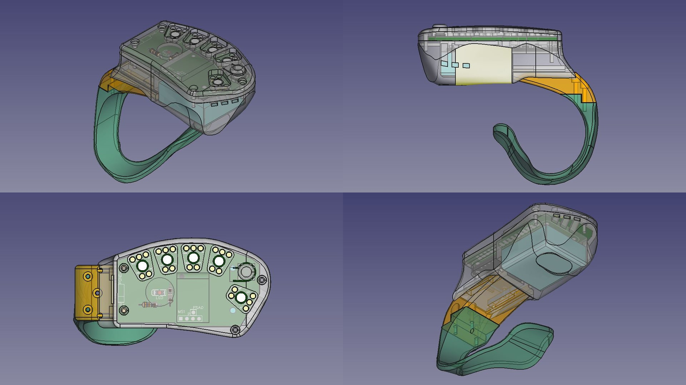

 

  <h1>GR SDK</h1>
  
GR is a precise gesture recognition and tracking wearable technology that allows digitalization of hand motions and emotions.

  
This SDK allows you to interact with hardware, algorithms and implement your own solutions based on GR technology.

  

    
    
    
  

## ✨ Features

- 📶 Easy interaction with hardware
- 📈 IMU Data reading
- ⚙️  Gestures recognition
- 👀 Palm tracking
- 🌍 Sign languages translation

## 🔗 Links

- [Instagram](https://www.instagram.com/brainhublab/)
- [Facebook](https://www.facebook.com/brainhublab)

## 🤝 Contact

Email us at [brainhublab@gmail.com](mailto:brainhublab@gmail.com)
